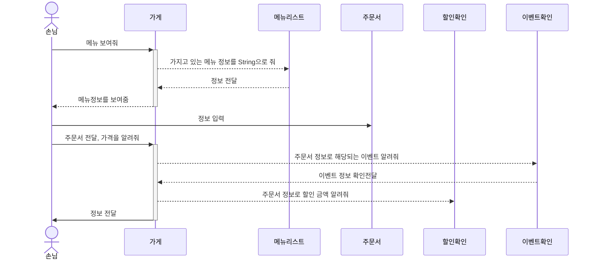
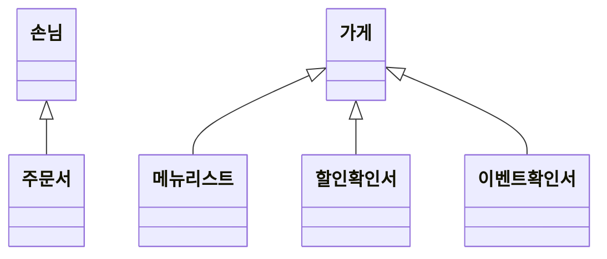

# 흐름도

```mermaid
sequenceDiagram 
	actor 손님 
	participant 가게 
	participant 메뉴리스트
	participant 주문서
	participant 할인확인
	participant 이벤트확인
	
	손님->>+가게: 메뉴 보여줘 
	가게-->>메뉴리스트: 가지고 있는 메뉴 정보를 String으로 줘
	메뉴리스트-->>가게: 정보 전달
	가게-->>-손님: 메뉴정보를 보여줌 

	손님->>주문서: 정보 입력
	손님->>+가게: 주문서 전달, 가격을 알려줘
	가게-->>이벤트확인: 주문서 정보로 해당되는 이벤트 알려줘
	이벤트확인-->>가게: 이벤트 정보 확인전달
	가게-->>할인확인: 주문서 정보로 할인 금액 알려줘
	가게->>-손님: 정보 전달
```

# 클래스 설계하기

```mermaid
classDiagram
	손님 <|-- 주문서

	가게 <|-- 메뉴리스트
	가게 <|-- 할인확인서
	가게 <|-- 이벤트확인서
	
```